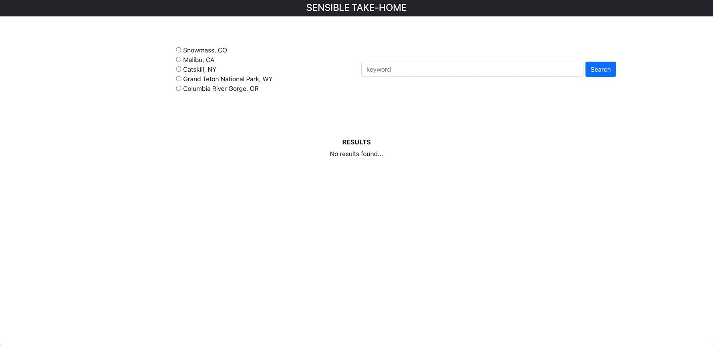

# Sensible Take Home

This project was really fun and I could've done another 4 hours making it look better and do cool things.

### Setup

```
git clone https://github.com/thall1961/sensible-takehome
npm install
npm start
```

`npm start` should start up our basic express server on port 8000 and react on port 3000

In the package.json, we proxy requests from React to localhost:8000 to interact with our api.

This project uses React Testing Library (Jest), React, React Hooks, Bootstrap, ESLint, and uses GitHub actions to make sure tests pass before allowing pull reqeust merges.


